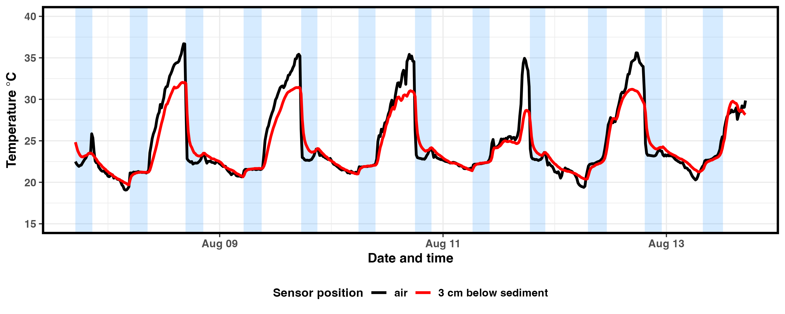
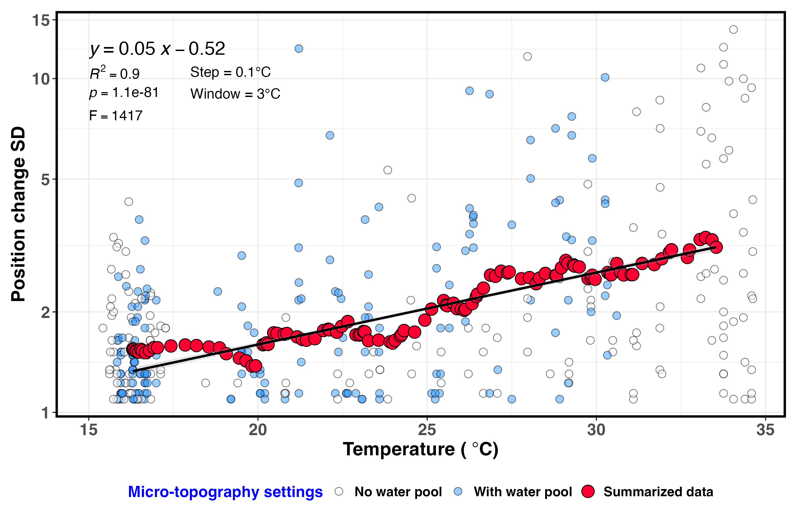

# 🔥 Thermal and Behavioural Response Analyses

This repository contains the combined workflow for processing and visualizing:

1. ** Sediment temperature time series** with tidal-inundation shading  
2. **Depth–temperature positional-variability analysis** using a moving-window approach

All analyses are executed from a single script:

`data_processing_and_depth_plots.R`

---

## 📂 Data Inputs

Place the following files in the repository root:

### ** HOBO temperature logger data**
- `PPCa0.csv`
- `PPCb0.csv`
- `PPCa3.csv`
- `PPCb3.csv`
- `tern_rect.csv` *(tidal inundation windows)*

### **Depth–temperature dataset**
- `cc_depth_temp.csv`

---

## 📊 Output Figures

### **1. Surface sediment temperature series**
**File:** `pp_sedimnt_tempData.png`


This figure shows the time series of air and sediment (3 cm depth) temperatures across the experimental period.  
Tidal inundation periods are highlighted as shaded intervals, offering a detailed look at thermal exposure cycles.

---

### **2. Positional variability under thermal stress**
**File:** `posSD_temp_ggplot.png`



This figure summarises how individual movement behaviour responds to temperature. It includes:

- daily mean temperatures,  
- the standard deviation of position (SD of depth/horizontal displacement),  
- moving-window averages,  
- and a fitted linear model relating temperature to positional variability.

Together, these outputs describe fine-scale behavioural responses under varying thermal conditions.

---

## ▶️ Running the Workflow

To run the full workflow and generate both figures, execute:

```r
source("data_processing_and_depth_plots.R")
```

The script will:
- read all required input CSV files from the repository root
- process the shelter time-series and depth–temperature datasets
- generate the following output files:
	- pp_shelters.png
	- posSD_temp_ggplot.png

---

## 📦 Required R Packages

The workflow requires the following R packages:

```r
library(plyr)
library(ggplot2)
library(gganimate)
library(gifski)
library(anytime)
library(scales)
library(png)
library(ggpubr)
library(plotrix)
library(car)
```
To install all required packages:

```r
install.packages(c(
  "plyr", "ggplot2", "gganimate", "gifski",
  "anytime", "scales", "png", "ggpubr",
  "plotrix", "car"
))
```

## 📜 Usage, Permissions, and Redistribution

This workflow is provided exclusively for academic and non-commercial research.
- Commercial use, including integration into proprietary software, consulting work, or paid services, requires explicit written permission from the authors.
- Public reposting or redistribution of figures, scripts, or derived data (e.g., on external websites, media, or reports) also requires prior approval.
- Some raw datasets may be subject to additional usage restrictions by their original providers.

For permissions or inquiries, please contact the repository maintainer.

---

## 📞 Contact

For questions, issues, or collaboration requests,
please open an issue on this repository or contact the maintainer directly.
 
